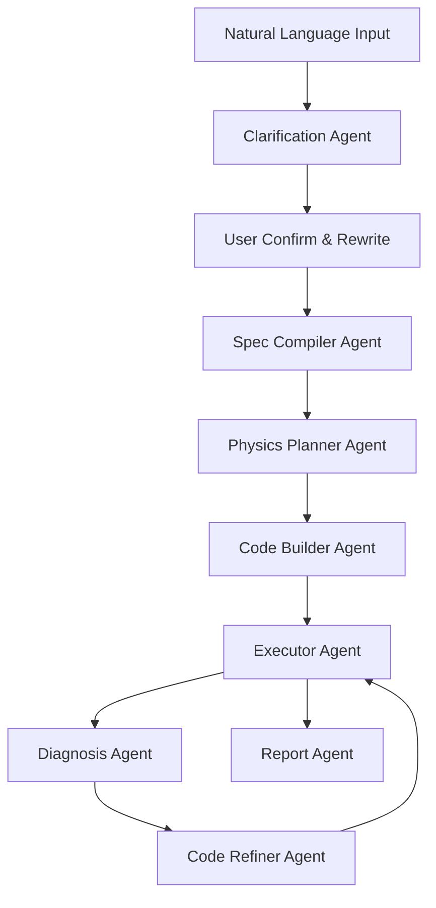

# Physical Simulation Multi-Agent Workflow Plan

## 1. 목표
자연어 입력을 기반으로 **자동으로 물리 모델을 명확화하고, 코드 생성/실행/오류수정/리포트까지 반복 수행**하는 멀티에이전트 시스템을 설계한다.

---

## 2. End-to-End 파이프라인



### 단계별 역할
1. **Clarification Agent**: 불명확한 요구(재료, BC, solver, 정확도)를 질문 템플릿으로 정리.
2. **Spec Compiler Agent**: 사용자 응답을 `SimulationSpec` JSON으로 변환.
3. **Physics Planner Agent**: DFT/MD/FEM/열-전기 결합 문제로 분류 후 toolchain 선택.
4. **Code Builder Agent**: 실행 가능한 Python 스크립트와 설정 파일 생성.
5. **Executor Agent**: 샌드박스에서 계산 실행, 로그/아티팩트 저장.
6. **Diagnosis Agent**: 수렴 실패, 단위 불일치, BC 오류 등 진단.
7. **Code Refiner Agent**: 진단 결과 기반 수정 후 재실행(최대 N회).
8. **Report Agent**: 7개 고정 섹션으로 결과 요약/해석/다음 실험 추천.

---

## 3. 상태 모델 (State Contract)

```yaml
state:
  request_id: str
  raw_input: str
  clarification_qna: list
  simulation_spec: object
  generated_code_paths: list
  run_attempt: int
  run_status: enum[pending,running,failed,success]
  logs: list
  diagnostics: list
  artifacts: list
  final_report: object
```

- 상태는 매 노드 종료 시 저장(체크포인트).
- 실패 시 마지막 성공 단계부터 재개 가능(resume).

---

## 4. 도메인별 모델링 전략

## 4.1 DFT/MD (ASE + GPAW 중심)
- 목적: 이온-결정 거리 vs 에너지, 결함(dislocation 포함) 거동 분석.
- 표준 절차:
  1) 초기 구조 생성/로드
  2) 결함 삽입(vacancy/interstitial/dislocation)
  3) 거리 sweep 및 single-point energy
  4) relaxation/NEB(필요시)
  5) 결과: PES, barrier, defect 근방 안정성

## 4.2 Joule Heating + Conductance + Switching (FEniCSx)
- 결합 방정식:
  - 전류 연속/전위 방정식
  - 열전달 방정식 with Joule source `Q = sigma(T,phase)|E|^2`
- 핵심 분석:
  - local temperature map
  - filament/hotspot 시각화
  - conductance 변화 곡선
  - IMT(절연체-금속 전이) 임계 조건

---

## 5. 환경 구성 권장안

## 5.1 로컬 개발
- IDE: VSCode
- Python: 3.11
- 환경: `conda` 또는 `uv`
- 핵심 패키지:
  - orchestration: `langgraph`, `langchain`, `pydantic`
  - api: `fastapi`, `uvicorn`
  - queue: `redis`, `rq` 또는 `celery`
  - simulation: `ase`, `gpaw`, `fenics-dolfinx`, `numpy`, `scipy`, `matplotlib`, `plotly`, `pyvista`
  - ml surrogate: `torch`

## 5.2 운영
- 컨테이너 기반 실행(Docker) + job queue
- 실행 메타데이터/실험 버전 기록(MLflow or W&B)
- 실패 자동 복구: 최대 3회 재시도 + 전략 변경

---

## 6. LLM 운영 전략

## 6.1 모델 라우팅
- 고난도 추론(플래너/진단): 상위 reasoning 모델
- 코드 생성/패치: 코딩 특화 중비용 모델
- 보고서 요약/포맷팅: 경량 모델

## 6.2 OpenRouter 사용 시 권장
- 장점: 단일 API로 다중 모델 라우팅/장애 회피
- 운영 팁:
  - 하드 예산 상한 설정
  - prompt caching
  - 모델 fallback 체인 구성

---

## 7. 필수 출력 포맷 (사용자 요청 7항목)
Report Agent는 아래 섹션을 항상 생성해야 한다.

1. 문제 정의와 목표
2. 해결 컨셉
3. 물리 개념/수식
4. PDE 경계조건(및 초기조건)
5. 결과의 물리적 의미
6. 민감 파라미터 + 수치 성능 고려
7. 다음 시뮬레이션 추천

---

## 8. 구현 우선순위 (PoC 4주)
- **1주차**: Clarification + Spec Compiler + JSON schema 검증
- **2주차**: DFT/MD 단일 시나리오 실행 파이프라인
- **3주차**: Joule heating coupled PDE 시나리오
- **4주차**: 자동 진단/수정 루프 + 보고서 자동 생성

---

## 9. 첫 번째 실행 시나리오 권장
1) Na+ 이온이 산화물 결정 격자 내에서 anion/cation 거리 변화에 따른 에너지 프로파일 산출.
2) dielectric breakdown 이후 filament 영역에서 Joule heating으로 인한 local conductance 변화 시각화.

이 두 시나리오를 통과하면, 이후 defect 확장/온도 의존성/다중 스케일 coupling으로 확장한다.
